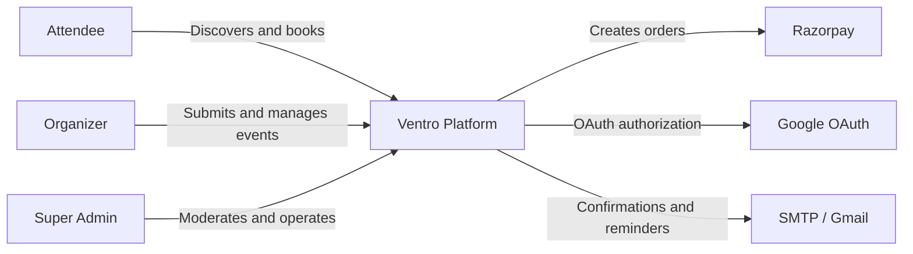
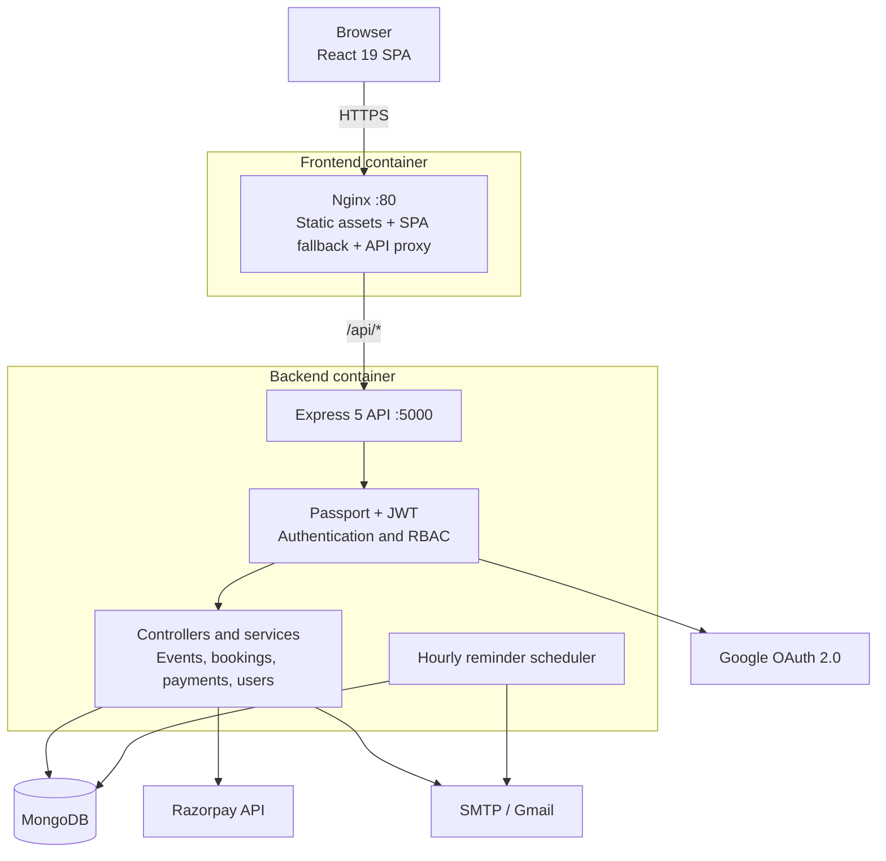
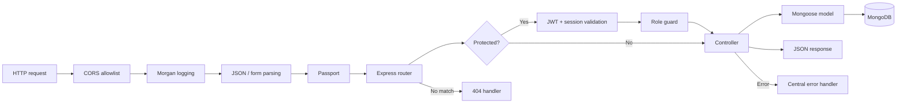
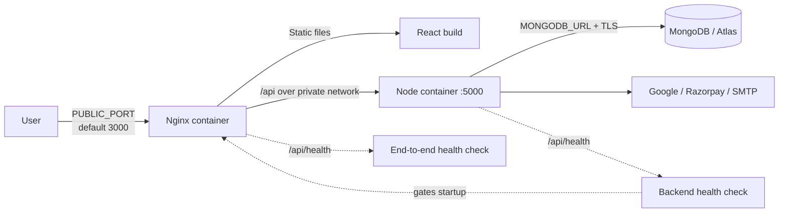
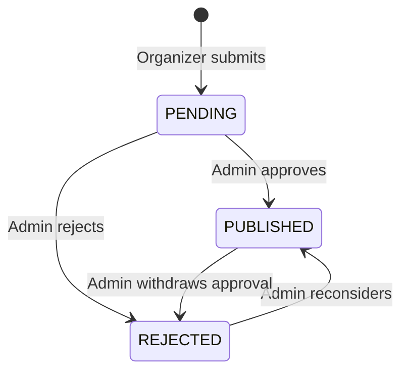
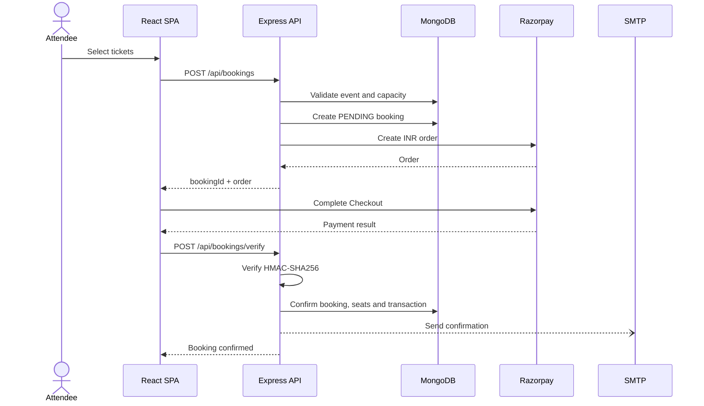
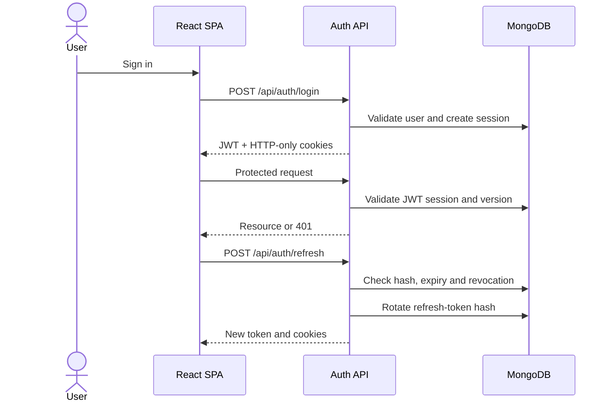
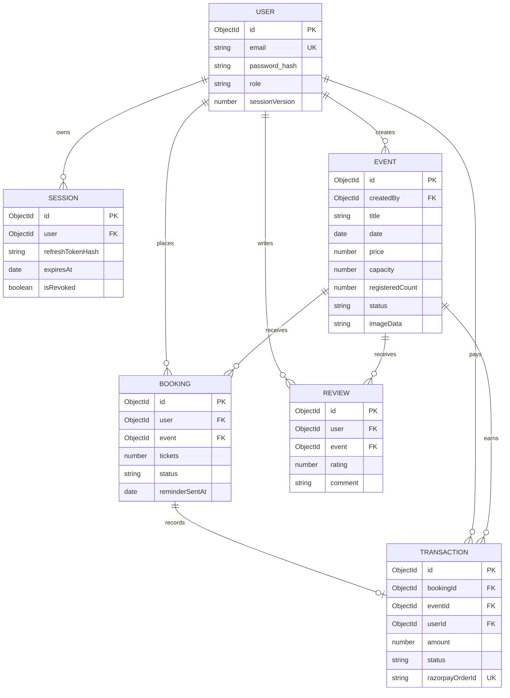

# Ventro

> A full-stack event operations platform for discovery, organizer publishing, moderation, ticketing, payments, and attendee communications.

[](https://react.dev/)
[](https://expressjs.com/)
[](https://mongoosejs.com/)
[](https://docs.docker.com/compose/)

Ventro gives attendees one place to discover and book events, organizers a workflow for submitting and monitoring events, and a fixed super administrator a dedicated moderation surface. It supports local and Google authentication, revocable sessions, free and Razorpay-backed bookings, email confirmations and reminders, and health-gated Docker deployment.

## Contents

- [Capabilities](#capabilities)
- [Architecture](#architecture)
- [Core workflows](#core-workflows)
- [Data model](#data-model)
- [Repository structure](#repository-structure)
- [Getting started](#getting-started)
- [Configuration](#configuration)
- [API reference](#api-reference)
- [Security](#security)
- [Deployment](#deployment)
- [Operations](#operations)
- [Quality and testing](#quality-and-testing)
- [Production-readiness notes](#production-readiness-notes)

## Capabilities

| Area | Capability |
| --- | --- |
| Identity | Email/password, Google OAuth 2.0, access/refresh JWTs, device-session revocation |
| Authorization | Attendee, organizer, and fixed super-admin API policies |
| Discovery | Published event listing, category filtering, search, event details and images |
| Event operations | Organizer submissions and admin approval/rejection |
| Ticketing | Capacity validation, free booking, paid orders, cancellation |
| Payments | Razorpay Checkout, server-side HMAC verification, transaction ledger |
| Communications | Booking confirmations and one-day reminders via SMTP or Gmail |
| Administration | User management, moderation, transactions, revenue and dashboard views |
| Runtime | SPA fallback, same-origin API proxy, health checks and graceful shutdown |

## Architecture

### System context



### Container architecture



In Compose, Nginx is the only published service. The API remains on the internal network and receives `/api/*` traffic through Nginx. MongoDB is external to the provided Compose file and is supplied through `MONGODB_URL`.

### Backend request pipeline



### Deployment topology



## Core workflows

### Event lifecycle



Only `PUBLISHED` events appear in public queries or accept bookings. The schema also reserves `CANCELLED` and `COMPLETED`, but the current moderation API exposes only the transitions above. Organizer updates cannot directly change status, ownership, registration count, or image metadata.

### Paid booking



Free events skip Razorpay, confirm immediately, increment `registeredCount`, and dispatch confirmation email.

### Session refresh



## Data model



Key constraints:

- Emails and Google IDs are unique; expired sessions use a TTL index.
- An organizer cannot create two events with the same title.
- A user has at most one booking per event/status tuple.
- Compound indexes support public status/category/date queries.
- Event images are stored with event documents and streamed from `/api/events/:id/image`.
- `Review` is modeled but not currently exposed by an API route.

## Repository structure

```text
EM_PROJECT/
├── client/
│   ├── public/                     # Static browser assets
│   ├── src/
│   │   ├── api/                    # Axios, refresh interceptor, token helpers
│   │   ├── components/             # Shared UI
│   │   ├── context/                # Authentication state
│   │   ├── lib/                    # Event-search trie
│   │   ├── pages/                  # Lazy-loaded screens
│   │   ├── App.jsx                 # Routes and admin redirect policy
│   │   └── main.jsx                # Browser entry point
│   ├── Dockerfile                  # Vite build -> Nginx
│   └── nginx.conf                  # SPA fallback and API proxy
├── server/
│   ├── config/                     # DB, Passport, environment, roles
│   ├── models/                     # Mongoose models
│   ├── src/
│   │   ├── controllers/            # HTTP use cases
│   │   ├── middlewares/            # Auth, RBAC, uploads
│   │   ├── route/                  # Express routes
│   │   └── services/               # Reminder scheduler
│   ├── utils/                      # Email templates
│   ├── app.js                      # Bootstrap and lifecycle
│   └── Dockerfile                  # Non-root Node image
├── benchmark/                      # Health-path load benchmark
├── compose.yaml                    # Production-like topology
├── .env.docker.example             # Public URL template
└── package.json                    # Root shortcuts
```

## Getting started

### Prerequisites

- Node.js 22 or a current compatible release
- npm
- MongoDB locally or MongoDB Atlas
- Optional: Docker Engine with Compose v2
- Optional: Google OAuth, Razorpay and SMTP credentials

### Local development

1. Install dependencies.

   ```powershell
   npm install --prefix client
   npm install --prefix server
   ```

2. Create configuration.

   ```powershell
   Copy-Item server\.env.example server\.env
   Copy-Item client\.env.example client\.env
   ```

3. Set at least `MONGODB_URL` in `server/.env`. Development JWT fallbacks are local-only.

4. Start each process in a separate terminal.

   ```powershell
   npm run server
   ```

   ```powershell
   npm run client
   ```

5. Open `http://localhost:5173`. The example client targets `http://localhost:5000/api`.

| Root command | Purpose |
| --- | --- |
| `npm run client` | Start Vite |
| `npm run server` | Start Express through Nodemon |
| `npm run client:build` | Build the production SPA |
| `npm run server:check` | Run the server syntax check |

## Configuration

Never commit real `.env` files. `VITE_*` values are public and embedded into the browser bundle.

### Backend

| Variable | Required | Purpose |
| --- | --- | --- |
| `NODE_ENV` | Production | Enables strict validation and secure cookies |
| `PORT` | No | Defaults to `5000` |
| `MONGODB_URL` | Yes | MongoDB connection URI |
| `JWT_SECRET` | Production | Access secret, 32+ non-placeholder characters |
| `JWT_REFRESH_SECRET` | Production | Distinct refresh secret, 32+ characters |
| `JWT_EXPIRE` / `JWT_REFRESH_EXPIRE` | No | Defaults to `7d` / `30d` |
| `CLIENT_URL` | Production | Canonical browser origin and CORS entry |
| `FRONTEND_URL` | No | Additional browser origin |
| `GOOGLE_CLIENT_ID`, `GOOGLE_CLIENT_SECRET`, `GOOGLE_CALLBACK_URL` | Google | OAuth configuration |
| `RAZORPAY_KEY_ID`, `RAZORPAY_KEY_SECRET` | Payments | Checkout and signature credentials |
| `SMTP_HOST`, `SMTP_PORT`, `SMTP_USER`, `SMTP_PASS` | Email | SMTP configuration |
| `EMAIL_FROM` | Email | Sender identity |
| `EMAIL_USER`, `EMAIL_PASS` | Fallback | Gmail development fallback |

Production rejects missing core variables, weak/placeholder JWT secrets, and non-HTTPS frontend origins.

### Frontend and Compose

| Variable | Scope | Purpose |
| --- | --- | --- |
| `VITE_API_URL` | Frontend | API base; use `/api` behind Nginx |
| `VITE_RAZORPAY_KEY_ID` | Frontend | Public Checkout key |
| `PUBLIC_URL` | Compose | Browser-facing origin |
| `PUBLIC_PORT` | Compose | Host port, default `3000` |
| `GOOGLE_CALLBACK_URL` | Compose | Browser-reachable callback |

## API reference

All endpoints are rooted at `/api`. Protected routes accept the application cookie or `Authorization: Bearer <token>`.

### Authentication

| Method | Endpoint | Access | Purpose |
| --- | --- | --- | --- |
| `POST` | `/auth/register` | Public | Register attendee or organizer |
| `POST` | `/auth/login` | Public | Start session |
| `POST` | `/auth/refresh` | Refresh cookie | Rotate tokens |
| `GET` | `/auth/google` | Public | Begin Google OAuth |
| `GET` | `/auth/google/callback` | Public | Complete Google OAuth |
| `POST` | `/auth/logout` | Public/idempotent | Revoke current session |
| `POST` | `/auth/logout-all` | Authenticated | Revoke all sessions |
| `GET` | `/auth/sessions` | Authenticated | List active devices |
| `DELETE` | `/auth/sessions/:sessionId` | Authenticated | Revoke device |
| `GET` | `/auth/me` | Authenticated | Current identity |

### Users and events

| Method | Endpoint | Access | Purpose |
| --- | --- | --- | --- |
| `GET/PUT/DELETE` | `/users/profile` | Authenticated | Manage profile |
| `PUT` | `/users/change-password` | Authenticated | Change password |
| `GET` | `/users/organizer-stats` | Organizer+ | Dashboard aggregates |
| `GET` | `/users` | Super admin | List users |
| `GET` / `DELETE` | `/users/:id` | Super admin | Read or delete user |
| `PUT` | `/users/:id/role` | Super admin | Change user role |
| `GET` | `/events` | Public | Published events |
| `GET` | `/events/categories/unique` | Public | Categories |
| `GET` | `/events/:id` | Public | Event details |
| `GET` | `/events/:id/image` | Public | Stream image |
| `GET` | `/events/mine` | Organizer+ | Owned events |
| `POST` | `/events` | Organizer+ | Multipart submission with `image` |
| `PUT/DELETE` | `/events/:id` | Organizer+ | Manage owned event |
| `GET` | `/events/moderation` | Super admin | Moderation queue |
| `PATCH` | `/events/:id/moderation` | Super admin | Publish or reject |

### Bookings and finance

| Method | Endpoint | Access | Purpose |
| --- | --- | --- | --- |
| `POST` | `/bookings` | Authenticated | Free booking or paid order |
| `POST` | `/bookings/verify` | Authenticated | Verify Razorpay result |
| `GET` | `/bookings/my-bookings` | Authenticated | Own bookings |
| `GET` | `/bookings/:id` | Owner/admin | Booking detail |
| `PUT` | `/bookings/:id/cancel` | Owner/admin | Cancel and restore seats |
| `GET` | `/transactions/my` | Authenticated | Own ledger |
| `GET` | `/transactions/event/:eventId` | Organizer+ | Event statement |
| `GET` | `/transactions` | Super admin | Platform ledger |
| `GET` | `/transactions/:id` | Owner | Receipt |
| `GET` | `/payments/my-transactions` | Authenticated | Legacy history view |
| `GET` | `/payments/event/:eventId` | Organizer+ | Legacy event view |

`GET /api/health` returns `200` only with a connected database and `503` otherwise.

## Security

- bcrypt password hashing; passwords excluded from ordinary queries.
- HTTP-only, `SameSite=Lax` cookies; production cookies require HTTPS.
- SHA-256 refresh-token hashes, rotation, expiry and per-device revocation.
- `sessionVersion` supports global JWT invalidation.
- Credentialed CORS is limited to configured origins.
- Passport authentication and route-level RBAC/ownership checks.
- Only attendee/organizer are publicly assignable; super-admin identity is fixed in `server/config/roles.js`.
- JPEG, PNG and WebP uploads are limited to 5 MB.
- Razorpay results receive server-side HMAC-SHA256 verification.
- Internal production errors are suppressed.
- The Node container runs as the unprivileged `node` user and shuts down cleanly.

For internet exposure, terminate TLS before Nginx, keep MongoDB private, rotate secrets, and add rate limiting, security headers, CSRF controls, centralized logs, dependency scanning and restore tests.

## Deployment

1. Create secret and interpolation files.

   ```powershell
   Copy-Item server\.env.example server\.env
   Copy-Item .env.docker.example .env
   ```

2. Set a reachable `MONGODB_URL`, distinct JWT secrets and enabled integration credentials in `server/.env`.
3. Set `PUBLIC_URL`, `PUBLIC_PORT` and the exact Google callback in root `.env`.
4. Build, start and verify.

   ```powershell
   docker compose up -d --build
   docker compose ps
   Invoke-RestMethod http://localhost:3000/api/health
   ```

The backend must become healthy before the frontend starts. The frontend check then traverses Nginx and the API.

### Production checklist

- [ ] HTTPS for public/frontend URLs and OAuth callbacks.
- [ ] Distinct high-entropy access and refresh secrets.
- [ ] Managed MongoDB replica set with TLS, backups and least privilege.
- [ ] Load balancer/ingress with certificates and request limits.
- [ ] Razorpay webhooks and reconciliation.
- [ ] Production SMTP with SPF, DKIM and DMARC.
- [ ] Central logs and health/error-rate alerts.
- [ ] Integration, concurrency and restore tests in staging.
- [ ] Versioned images and a documented rollback.

## Operations

- `/api/health` is the readiness/liveness endpoint.
- Startup waits for MongoDB.
- Reminder scanning runs at startup and hourly, processing up to 100 eligible bookings.
- `SIGTERM`/`SIGINT` stop reminders, drain HTTP and close MongoDB.
- Morgan uses `dev` locally and `combined` in production.

Run the full local ingress benchmark:

```powershell
node benchmark\health-load.mjs http://localhost:3000/api/health 500 20
```

Recorded trial: 500/500 success, 31.23 ms mean, 37.94 ms p95 and 626.20 requests/second at concurrency 20. This is a lightweight health-path baseline, not production workload evidence. See [benchmark results](benchmark/RESULTS.md).

| Symptom | First checks |
| --- | --- |
| Health returns `503` | `MONGODB_URL`, DB network/TLS and backend logs |
| API calls fail through UI | Nginx proxy, backend health and origin config |
| CORS error | Exact `CLIENT_URL`/`FRONTEND_URL` match |
| Google login fails | Exact callback in config and Google Console |
| Paid booking config error | Both server Razorpay values and frontend public key |
| Email skipped | SMTP/Gmail credentials and sender |
| Refresh loops on `401` | Session state, cookies, HTTPS proxy headers and clocks |

## Quality and testing

```powershell
npm run client:build
npm run server:check
node benchmark\health-load.mjs http://localhost:3000/api/health 500 20
```

`server:check` currently validates syntax only. Production CI should add frontend linting, unit and API integration tests, authorization matrices, payment fixtures, booking-concurrency tests, container scanning and end-to-end smoke tests.

## Production-readiness notes

The runtime includes meaningful production controls, but resolve these before handling real traffic or money:

1. **Atomic inventory:** booking, payment, seat and ledger writes are separate. Use MongoDB transactions plus an atomic capacity predicate or expiring reservations.
2. **Payment reconciliation:** add Razorpay webhooks, idempotency, order ownership checks, constant-time signature comparison, refunds and reconciliation.
3. **CSRF and token exposure:** protect cookie-authenticated mutations. Google callback currently puts an access token in the query; prefer a one-time code or cookie-only flow.
4. **Horizontal scheduling:** every API replica runs the timer. Move reminders to a queue/worker or distributed lease.
5. **Image storage:** use object storage and CDN URLs when scale warrants it.
6. **Abuse controls:** add request schemas, body limits, throttling, security headers and audit logs.
7. **Test depth:** syntax checking alone cannot certify booking, authorization or payment behavior.

## Contributing

Keep changes focused, preserve authorization/ownership checks, never commit secrets, and run relevant build/lint/server checks. Schema or payment changes should include migration, rollback, duplicate-delivery and concurrency tests.
